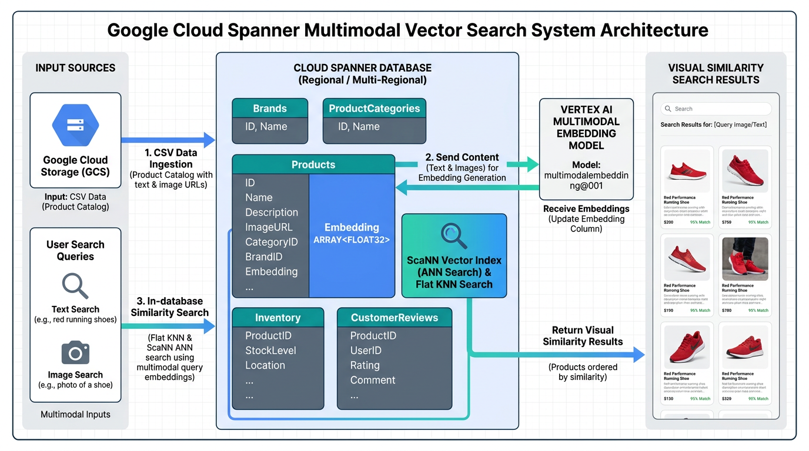
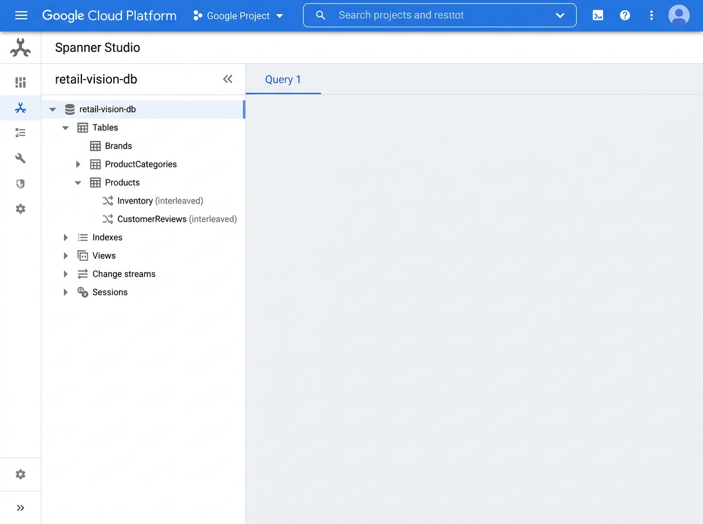
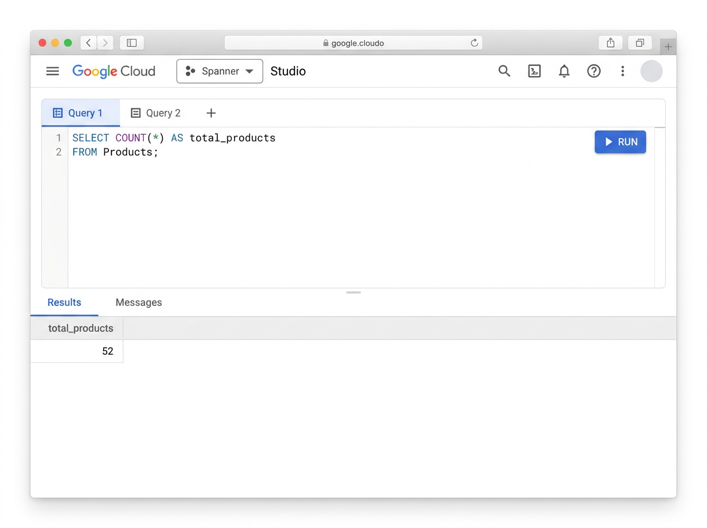

author: Rishi
summary: Enterprise Multimodal Vector Search, GCS Ingestion, and ANN Indexing in Google Cloud Spanner
id: spanner-multimodal-vector-retail
categories: Databases, AI, Spanner
tags: spanner, vectorsearch, multimodal, embeddings, ann, scann, vertexai, retail, gcs
status: Published
Feedback Link: https://github.com/GoogleCloudPlatform/

# Enterprise Multimodal Vector Search, GCS Ingestion, and ANN Indexing in Google Cloud Spanner

## 1. Overview
Duration: 5:00

In the modern retail and e-commerce landscape, search has evolved far beyond traditional keyword and exact attribute matching. Customers now expect to search using natural, conversational language (e.g., *"comfortable casual cropped pants"*) or even upload an image directly to find visually similar items across a product catalog. These capabilities are powered by **multimodal vector search**, which projects both text descriptions and product media into a shared high-dimensional vector space where semantic and visual similarities can be measured mathematically.

Historically, implementing these features meant setting up a complex, fragile architecture: extracting operational data from a primary transactional database, piping it through external ETL tools to a separate specialized vector database, and managing synchronization latency.

**Google Cloud Spanner** eliminates this friction. As a globally scalable, enterprise-grade, relational database with up to 99.999% availability, Spanner natively supports operational transactions, in-database machine learning generation, and high-performance vector search in a single unified database engine.

### Architectural Overview

In this codelab, you will build an end-to-end retail catalog vector search system. You will copy real product media and structured catalog assets from `gs://sample-data-and-media` into your project's Google Cloud Storage (GCS) bucket, ingest operational data into Cloud Spanner, generate multimodal vector embeddings natively using Spanner AI, perform exact Flat K-NN scans, and transition to optimized Approximate Nearest Neighbor (ANN) index-based searches using Google's state-of-the-art **ScaNN (Score-aware Quantization Loss)** algorithm.



### What You Will Build
* A multi-table relational schema with interleaved transactional tables (`Brands`, `ProductCategories`, `Products`, `Inventory`, and `CustomerReviews`).
* Real media ingestion from `gs://sample-data-and-media` into your private GCS bucket (`gs://${BUCKET_NAME}`).
* A robust, zero-ETL integration between Spanner and Vertex AI's `multimodalembedding@001` model.
* Native, in-database SQL vector similarity queries covering:
  1. **Catalog Image-to-Image Search**: Finding visually similar items given an existing catalog product.
  2. **Ad-Hoc GCS Image Search**: Passing an external query image from GCS directly into `ML.PREDICT` inside a `CROSS JOIN` without inserting it into a table first.
  3. **Hybrid Cross-Modal Text-to-Image Search**: Converting a natural-language search prompt to an embedding on-the-fly and joining relational tables (`Inventory` and `Brands`).
* An optimized ScaNN-based Approximate Nearest Neighbor (ANN) vector index.
* A monitoring workflow to observe and manage background index backfills.

### What You Will Learn
* How to design Spanner schemas for high-performance vector operations.
* How to register and execute remote Vertex AI multimodal models inside Spanner.
* The computational differences between exact Flat K-NN scans (`COSINE_DISTANCE`) and Approximate Nearest Neighbor (ANN) indexed search (`APPROX_COSINE_DISTANCE`).
* How to monitor background asynchronous index builds using system metadata.
* How to tune vector index latency and recall tradeoffs dynamically inside SQL queries.

---

## 2. Environment Setup & IAM Roles
Duration: 7:00

In this step, you will configure your Google Cloud Shell environment, enable the necessary APIs, and set up the critical IAM permissions required for Spanner to talk to Vertex AI.

### Configure Environment Variables
Open your **Google Cloud Shell** and execute the following commands to export the required environment variables. Replace `YOUR_PROJECT_ID` with your actual Google Cloud Project ID and choose your preferred `REGION` (defaulting to `us-central1`, or any supported region where Cloud Spanner, GCS, and Vertex AI `multimodalembedding@001` are available, such as `us-central1`, `us-east4`, `europe-west1`, `europe-west4`, `asia-southeast1`, or `asia-northeast1`):

```bash
# Export configuration variables (Replace YOUR_PROJECT_ID and choose your preferred REGION)
export PROJECT_ID="YOUR_PROJECT_ID"
export REGION="us-central1"   # e.g., us-central1, us-east4, europe-west1, asia-southeast1
export INSTANCE_ID="retail-spanner-instance"
export DATABASE_ID="retail-vision-db"
export BUCKET_NAME="${PROJECT_ID}-retail-assets"

# Set the active gcloud project
gcloud config set project ${PROJECT_ID}
```

### Enable Google Cloud APIs
You must enable the APIs for Spanner, Vertex AI (AI Platform), and Google Cloud Storage. Run the following command:

```bash
gcloud services enable \
    spanner.googleapis.com \
    aiplatform.googleapis.com \
    storage.googleapis.com
```

### Configure the Spanner Service Agent IAM Permissions
Cloud Spanner uses a system-managed **Service Agent** service account to securely execute remote operations (such as calling Vertex AI models). This service account must be granted the `roles/aiplatform.user` (Vertex AI User) role on your project.

1. First, retrieve your project's numerical ID:
```bash
export PROJECT_NUMBER=$(gcloud projects describe ${PROJECT_ID} --format="value(projectNumber)")
```

2. Formulate the Spanner and Vertex AI Service Agent identifiers:
```bash
export SPANNER_SERVICE_AGENT="service-${PROJECT_NUMBER}@gcp-sa-spanner.iam.gserviceaccount.com"
export VERTEX_SERVICE_AGENT="service-${PROJECT_NUMBER}@gcp-sa-aiplatform.iam.gserviceaccount.com"
```

3. Explicitly provision the Spanner and Vertex AI Service Agent identities to ensure they exist before assigning IAM roles:
```bash
gcloud beta services identity create --service=spanner.googleapis.com --project=${PROJECT_ID}
gcloud beta services identity create --service=aiplatform.googleapis.com --project=${PROJECT_ID}
```

4. Grant required IAM roles to the Spanner and Vertex AI Service Agents:
Spanner needs permission to call Vertex AI online prediction models (`roles/aiplatform.user`). Furthermore, because Vertex AI reads images directly from your Cloud Storage bucket during visual embedding inference, both Spanner and the Vertex AI service agent require Cloud Storage read permissions (`roles/storage.objectViewer`):

```bash
# Allow Spanner to call Vertex AI models
gcloud projects add-iam-policy-binding ${PROJECT_ID} \
    --member="serviceAccount:${SPANNER_SERVICE_AGENT}" \
    --role="roles/aiplatform.user" \
    --condition=None

# Allow Spanner and Vertex AI to read media assets from Cloud Storage
gcloud projects add-iam-policy-binding ${PROJECT_ID} \
    --member="serviceAccount:${SPANNER_SERVICE_AGENT}" \
    --role="roles/storage.objectViewer" \
    --condition=None

gcloud projects add-iam-policy-binding ${PROJECT_ID} \
    --member="serviceAccount:${VERTEX_SERVICE_AGENT}" \
    --role="roles/storage.objectViewer" \
    --condition=None
```

> [!NOTE]
> **Unconditional IAM Bindings & Interactive Prompts:**
> Supplying `--condition=None` ensures that the role bindings are applied unconditionally at the project level, even if your Google Cloud project already contains conditional IAM bindings. If `gcloud` ever prompts you interactively to choose an IAM condition (e.g., `[1] ... [2] ... [3] None [4] Specify a new condition`), select **`None`** to proceed.
>
> IAM role propagation can sometimes take 1-2 minutes to fully update. If you experience an authorization error when executing `ML.PREDICT` later, wait a moment and try the query again.

---

## 3. Provision Cloud Spanner Instance & Database
Duration: 5:00

Now, you will provision a regional Cloud Spanner instance and create your database using the **GoogleSQL** dialect.

### Create the Spanner Instance
Create a regional Spanner instance in your configured `${REGION}` using `--config=regional-${REGION}` and `--edition=ENTERPRISE` (required for Cloud Spanner vector search capabilities). For cost-efficiency, we will configure this instance with 100 Processing Units (0.1 nodes):

```bash
gcloud spanner instances create ${INSTANCE_ID} \
    --config=regional-${REGION} \
    --description="Retail Vision Instance" \
    --edition=ENTERPRISE \
    --processing-units=100
```

### Create the Database
Create the database named `retail-vision-db` inside your new Spanner instance:

```bash
gcloud spanner databases create ${DATABASE_ID} \
    --instance=${INSTANCE_ID} \
    --database-dialect=GOOGLE_STANDARD_SQL
```

---

## 4. Stage GCS Media & Ingest Data into Spanner
Duration: 10:00

To simulate an authentic enterprise workflow, you will import structured retail metadata into Spanner first, leaving the `image_embedding` column as `NULL`. All vector embeddings will be generated directly in-database using Spanner AI in subsequent steps.

Vertex AI's Multimodal Embedding model requires real, valid images stored in Cloud Storage to generate visual embeddings. If you pass empty or broken image URLs, embedding generation will fail. To solve this, you will copy verified product media and tables directly from `gs://sample-data-and-media` into your own project bucket (`gs://${BUCKET_NAME}`).

### Step 1: Create Your Private Cloud Storage Bucket
Create a dedicated regional bucket in your project to stage product images, catalog tables, and query inputs, co-located in the exact same `${REGION}` as Spanner and Vertex AI:

```bash
gcloud storage buckets create gs://${BUCKET_NAME} --location=${REGION}
```

### Step 2: Copy Verified Media from `gs://sample-data-and-media`
Copy the verified Generic E-Commerce Retail Catalog media and datasets from `gs://sample-data-and-media` into your project's bucket. To optimize transfer time and avoid copying 22,400+ unused images, pipe the first 52 image URIs to copy only the exact assets seeded into the Spanner database:

```bash
# Copy only the exact 52 product images needed for the demo catalog
gcloud storage ls gs://sample-data-and-media/ecomm-retail/product-images-generic/*.png \
    | head -n 52 \
    | gcloud storage cp -I gs://${BUCKET_NAME}/ecomm-retail/product-images-generic/

# Copy catalog tables and review datasets
gcloud storage cp gs://sample-data-and-media/ecomm-retail/ecomm_csv.zip gs://sample-data-and-media/ecomm-retail/product_reviews.csv gs://${BUCKET_NAME}/ecomm-retail/
```

### Step 3: Stage an External Query Image for Ad-Hoc Similarity Search
To test **Ad-Hoc Visual Search** at query time without inserting new items into the database, stage a sample apparel image into a dedicated `query-images/` folder in your bucket:

```bash
gcloud storage cp gs://${BUCKET_NAME}/ecomm-retail/product-images-generic/00003E3B9E5336685200AE85D21B4F5E.png gs://${BUCKET_NAME}/query-images/sample_query_bed.png
```

### Step 4: Apply Relational Schema DDL in Spanner
Run the following gcloud command to apply the relational tables definition to Spanner. Note the definition of `image_embedding` as an `ARRAY<FLOAT64>(vector_length=>1408)` to enforce vector dimension constraints matching Vertex AI's `multimodalembedding@001` model:

```bash
gcloud spanner databases ddl update ${DATABASE_ID} \
    --instance=${INSTANCE_ID} \
    --ddl='
    CREATE TABLE Brands (
      brand_id INT64 NOT NULL,
      brand_name STRING(100),
      tier STRING(50),
      country_of_origin STRING(50),
    ) PRIMARY KEY (brand_id);

    CREATE TABLE ProductCategories (
      category_id INT64 NOT NULL,
      category_name STRING(50),
      department STRING(50),
    ) PRIMARY KEY (category_id);

    CREATE TABLE Products (
      product_id STRING(36) NOT NULL,
      brand_id INT64 NOT NULL,
      category_id INT64 NOT NULL,
      name STRING(150) NOT NULL,
      description STRING(MAX),
      color STRING(50),
      list_price NUMERIC,
      image_gcs_uri STRING(MAX),
      image_embedding ARRAY<FLOAT64>(vector_length=>1408),
    ) PRIMARY KEY (product_id);

    CREATE TABLE Inventory (
      product_id STRING(36) NOT NULL,
      store_id STRING(20) NOT NULL,
      stock_count INT64,
      last_restock_timestamp TIMESTAMP,
    ) PRIMARY KEY (product_id, store_id),
      INTERLEAVE IN PARENT Products ON DELETE CASCADE;

    CREATE TABLE CustomerReviews (
      product_id STRING(36) NOT NULL,
      review_id STRING(36) NOT NULL,
      rating INT64,
      review_text STRING(MAX),
      review_date DATE,
    ) PRIMARY KEY (product_id, review_id),
      INTERLEAVE IN PARENT Products ON DELETE CASCADE;'
```

### Step 5: Install Python Prerequisites & Run Ingestion Script
To populate the database tables, we will use a Python seeding utility. The script inspects your GCS bucket, discovers the copied product images, derives accurate brand, category, title, description, and pricing metadata, and sets `image_gcs_uri` to point directly to each exact copied image in `gs://${BUCKET_NAME}/...`.

1. Install the Google Cloud client libraries in your Cloud Shell environment:
```bash
pip install --quiet google-cloud-spanner google-cloud-storage
```

2. Create the ingestion script `import_data.py`:
```bash
cat << 'EOF' > import_data.py
import os
import sys
from decimal import Decimal
from google.cloud import storage
from google.cloud import spanner

# Disable Cloud Monitoring metric export warnings in Cloud Shell
os.environ["SPANNER_DISABLE_BUILTIN_METRICS"] = "true"

def main():
    project_id = os.environ.get("PROJECT_ID")
    instance_id = os.environ.get("INSTANCE_ID")
    database_id = os.environ.get("DATABASE_ID")
    bucket_name = os.environ.get("BUCKET_NAME")

    if not all([project_id, instance_id, database_id, bucket_name]):
        print("Error: Ensure PROJECT_ID, INSTANCE_ID, DATABASE_ID, and BUCKET_NAME are exported in env.")
        sys.exit(1)

    print(f"Connecting to Cloud Spanner database: {database_id} on instance {instance_id}...")
    spanner_client = spanner.Client(project=project_id, disable_builtin_metrics=True)
    instance = spanner_client.instance(instance_id)
    database = instance.database(database_id)

    print(f"Inspecting staged assets in Cloud Storage bucket: gs://{bucket_name}/ecomm-retail/...")
    storage_client = storage.Client(project=project_id)

    blobs = list(storage_client.list_blobs(bucket_name, prefix="ecomm-retail/product-images-generic/"))
    image_blobs = [b for b in blobs if b.name.lower().endswith(('.png', '.jpg', '.jpeg'))]

    if not image_blobs:
        print(f"Error: No images found in gs://{bucket_name}/ecomm-retail/product-images-generic/! Please run the Step 2 GCS copy command first.")
        sys.exit(1)

    print(f"Discovered {len(image_blobs)} catalog media files in GCS.")

    # Ensure 00003E3B9E5336685200AE85D21B4F5E.png is prod_001 for consistent codelab queries
    target_crop_pant = [b for b in image_blobs if "00003E3B9E5336685200AE85D21B4F5E" in b.name]
    other_blobs = [b for b in image_blobs if "00003E3B9E5336685200AE85D21B4F5E" not in b.name]
    sorted_image_blobs = target_crop_pant + sorted(other_blobs, key=lambda x: x.name)

    # Reference Taxonomies
    brands = [
        (1, "Joan Ellis", "Comfort", "United States"),
        (2, "Dean Sterling", "Luxury", "United Kingdom"),
        (3, "KIMODE", "Everyday", "Japan"),
        (4, "Honest Virtue", "Denim", "United States"),
        (5, "Commonwealth", "Classic", "United States"),
        (6, "Riff Depot", "Streetwear", "Canada"),
        (7, "Sterling Standard", "Denim", "United States"),
        (8, "Willowbend", "Denim", "United States")
    ]
    categories = [
        (1, "Pants & Capris", "Apparel"),
        (2, "Fashion Hoodies & Sweatshirts", "Apparel"),
        (3, "Suits & Sport Coats", "Apparel"),
        (4, "Sweaters & Knits", "Apparel"),
        (5, "Jeans & Denim", "Apparel"),
        (6, "Tops & Tees", "Apparel")
    ]

    sku_metadata = {
        "00003E3B9E5336685200AE85D21B4F5E": (1, 1, "Joan Ellis Women's Crop Pant", "Versatile cropped casual pant tailored with breathable fabric for comfort and everyday style.", Decimal("99.00")),
        "0004D0B59E19461FF126E3A08A814C33": (6, 2, "Hampton Tradinghouse Women's Hoodie", "Comfortable fleece hoodie designed for warmth and casual weekend styling.", Decimal("79.95")),
        "00053F5E11D1FE4E49A221165B39ABC9": (2, 3, "Dean Sterling Double-Breasted Suit Jacket", "Premium twill weave double-breasted suit jacket tailored for formal elegance.", Decimal("219.50")),
        "0006AABE0BA47A35C0B0BF6596F85159": (3, 4, "KIMODE Men's Essential V-Neck Sweater", "Classic lightweight knit sweater with a clean V-neck profile.", Decimal("50.00")),
        "000871C1FC726F0B52DC86A4EEB027DE": (4, 5, "Honest Virtue Women's Cameron Boyfriend Jean", "Relaxed fit distressed boyfriend denim crafted with premium organic cotton.", Decimal("235.00")),
        "00126B47D5502DFB7D01F750AD23D813": (5, 6, "Commonwealth Plaid Long-Sleeve Shirt", "Classic medium plaid pattern woven shirt for all-season versatility.", Decimal("29.99")),
        "0014FCB3DB4C8459D26309B177005B10": (6, 6, "Riff Depot Ribbed Fold Beanie", "Soft ribbed knit fold-over beanie providing essential warmth.", Decimal("15.99")),
        "001AB2FA029C064A45E41F8B2644A292": (7, 5, "Sterling Standard Straight Leg Jean", "Timeless straight leg blue denim with contrast stitching.", Decimal("119.00")),
        "001B8E3CF76F4E64CBE5BE9882DB4AA0": (1, 6, "Jenson Metallic Halter Swimwear", "Vibrant halter swimwear crafted with fast-drying stretch blend.", Decimal("19.99")),
        "001C728A3046207C685F7F478F4BB41B": (8, 5, "Willowbend Classic Rise Straight Jean", "Durable rugged denim featuring reinforced pockets and relaxed leg cut.", Decimal("123.94")),
    }

    colors = ["Natural Olive", "Classic Navy", "Charcoal Gray", "Warm Camel", "Midnight Black", "Heather Indigo"]
    products_rows = []
    inventory_rows = []
    reviews_rows = []

    for idx, blob in enumerate(sorted_image_blobs[:52], start=1):
        pid = f"prod_{idx:03d}"
        fname = blob.name.split("/")[-1]
        sku = fname.rsplit(".", 1)[0]
        if sku in sku_metadata:
            bid, cid, title, desc, price = sku_metadata[sku]
        else:
            bid = (idx % len(brands)) + 1
            cid = (idx % len(categories)) + 1
            cat_name = categories[cid - 1][1]
            brand_name = brands[bid - 1][1]
            title = f"{brand_name} {cat_name} {idx:03d}"
            desc = f"Premium quality {cat_name.lower()} crafted for comfort, style, and everyday wear."
            price = Decimal(f"{49.99 + (idx * 2):.2f}")

        color = colors[idx % len(colors)]
        gcs_uri = f"gs://{bucket_name}/{blob.name}"
        products_rows.append((pid, bid, cid, title, desc, color, price, gcs_uri, None))

        # Child records: Inventory
        inventory_rows.append((pid, "store_nyc", 25 + (idx % 20), "2026-09-01T08:00:00Z"))
        inventory_rows.append((pid, "store_sf", 15 + (idx % 12), "2026-09-02T12:30:00Z"))

        # Child records: CustomerReviews
        reviews_rows.append((pid, f"rev_{idx}_1", 5 - (idx % 2), "Outstanding fit, high quality fabric, and very stylish!", "2026-09-10"))
        if idx % 3 == 0:
            reviews_rows.append((pid, f"rev_{idx}_2", 4, "Great durable material and fast delivery.", "2026-09-12"))

    print(f"Writing mutations to Cloud Spanner using idempotent batch mutations ({len(products_rows)} products)...")
    with database.batch() as batch:
        batch.insert_or_update(
            "Brands",
            columns=["brand_id", "brand_name", "tier", "country_of_origin"],
            values=brands,
        )
        batch.insert_or_update(
            "ProductCategories",
            columns=["category_id", "category_name", "department"],
            values=categories,
        )
        batch.insert_or_update(
            "Products",
            columns=["product_id", "brand_id", "category_id", "name", "description", "color", "list_price", "image_gcs_uri", "image_embedding"],
            values=products_rows,
        )
        batch.insert_or_update(
            "Inventory",
            columns=["product_id", "store_id", "stock_count", "last_restock_timestamp"],
            values=inventory_rows,
        )
        batch.insert_or_update(
            "CustomerReviews",
            columns=["product_id", "review_id", "rating", "review_text", "review_date"],
            values=reviews_rows,
        )

    print(f"Database seeding successfully completed! {len(products_rows)} products populated with verified GCS URIs.")

if __name__ == "__main__":
    main()
EOF
```

3. Run the ingestion script:
```bash
python3 import_data.py
```

### Step 6: Verify Seeding Output
Confirm that records were successfully written to Cloud Spanner. You can inspect your database via **Spanner Studio** in the Google Cloud Console or directly through the Cloud Shell CLI.

1. In the Google Cloud Console, navigate to **Spanner Studio**. Verify that the tables schema has been successfully created:



2. Run a query in Spanner Studio to count the rows in `Products`:
```sql
SELECT COUNT(*) AS total_products FROM Products;
```



Confirm that the output grid displays `52` products.

3. Verify sample rows and confirm that `image_embedding` is currently `NULL`:
```bash
gcloud spanner databases execute-sql ${DATABASE_ID} \
    --instance=${INSTANCE_ID} \
    --sql="SELECT product_id, name, color, list_price, image_gcs_uri, image_embedding FROM Products LIMIT 3;"
```

Notice that every `image_gcs_uri` points directly to an existing image in your project's bucket `gs://${BUCKET_NAME}/...`, and `image_embedding` reads `None` or `NULL`.

---

## 5. Register Vertex AI Multimodal Embedding Models in Spanner
Duration: 5:00

With your database seeded, you must register Vertex AI's standard `multimodalembedding@001` publisher model inside Spanner using `CREATE MODEL` DDL. This creates virtual database model endpoints that can be queried seamlessly using standard GoogleSQL via `ML.PREDICT`.

### Understanding the Model Signatures and Cloud Spanner Requirements

Vertex AI's `multimodalembedding@001` model maps both images and text into a shared 1408-dimensional embedding space. However, its REST API imposes specific schema rules:
1. **CamelCase Field Naming**: The API requires camelCase input/output identifiers:
   - Image input: `image STRUCT<gcsUri STRING(MAX)>` (notice camelCase `gcsUri`).
   - Text input: `text STRING(MAX)`.
   - Output vectors: `imageEmbedding ARRAY<FLOAT64>` for image inputs, and `textEmbedding ARRAY<FLOAT64>` for text inputs.
2. **Strict Output Column Enforcement**: In Cloud Spanner, `ML.PREDICT` requires that every column declared in the model's `OUTPUT(...)` clause is returned in the prediction response payload. Because `multimodalembedding@001` returns *only* `imageEmbedding` when passed an image and *only* `textEmbedding` when passed text, declaring both outputs in a single model causes runtime errors.
3. **Dedicated Endpoints**: To solve this cleanly, we register two distinct virtual models in Spanner pointing to the same underlying Vertex AI endpoint:
   - `ImageEmbeddings`: Dedicated to visual vector embeddings for product catalog media and image queries.
   - `TextMultimodalEmbeddings`: Dedicated to natural language search queries in the same vector space.

Execute the following command to register both models with `default_batch_size = 1`:

```bash
gcloud spanner databases ddl update ${DATABASE_ID} \
    --instance=${INSTANCE_ID} \
    --ddl="
    CREATE OR REPLACE MODEL ImageEmbeddings
    INPUT(
      image STRUCT<gcsUri STRING(MAX)>
    )
    OUTPUT(
      imageEmbedding ARRAY<FLOAT64>
    )
    REMOTE OPTIONS (
      endpoint = '//aiplatform.googleapis.com/projects/${PROJECT_ID}/locations/${REGION}/publishers/google/models/multimodalembedding@001',
      default_batch_size = 1
    );

    CREATE OR REPLACE MODEL TextMultimodalEmbeddings
    INPUT(
      text STRING(MAX)
    )
    OUTPUT(
      textEmbedding ARRAY<FLOAT64>
    )
    REMOTE OPTIONS (
      endpoint = '//aiplatform.googleapis.com/projects/${PROJECT_ID}/locations/${REGION}/publishers/google/models/multimodalembedding@001',
      default_batch_size = 1
    );"
```

### Key Elements of the Model DDL
* **`ImageEmbeddings` Signature**: Accepts an `image` struct containing `gcsUri STRING(MAX)` pointing to an image in GCS, returning `imageEmbedding ARRAY<FLOAT64>`.
* **`TextMultimodalEmbeddings` Signature**: Accepts `text STRING(MAX)` containing the query string, returning `textEmbedding ARRAY<FLOAT64>`.
* **Shared Embedding Space**: Because both models point to `multimodalembedding@001`, vectors from `ImageEmbeddings` and `TextMultimodalEmbeddings` are directly comparable using `COSINE_DISTANCE` and `APPROX_COSINE_DISTANCE`.
* **`default_batch_size = 1`**: Restricts the batch size of online prediction requests dispatched from Spanner to Vertex AI to 1 instance per RPC. This guarantees reliable execution and prevents payload size errors when transmitting heavy image references.

---

## 6. Generate In-Database Multimodal Embeddings
Duration: 8:00

Now comes the power of Spanner AI. In traditional architectures, generating embeddings requires extracting rows from the operational database, sending images to an external embedding service via application code, and writing vectors back via custom pipelines. 

Cloud Spanner eliminates this complexity by integrating `ML.PREDICT` directly into the database engine. Cloud Spanner supports **two distinct DML patterns** to generate and populate vector embeddings in-database. You can run either option based on your workload needs:

### Option A: Direct `UPDATE ... SET` (Simplest for Small-to-Medium Tables)
Updates only the `image_embedding` column in place across all rows where `image_embedding IS NULL`. This is the cleanest and most direct approach when updating existing records:

```bash
gcloud spanner databases execute-sql ${DATABASE_ID} \
    --instance=${INSTANCE_ID} \
    --sql="
    UPDATE Products
    SET image_embedding = (
      SELECT p.imageEmbedding
      FROM ML.PREDICT(
        MODEL ImageEmbeddings,
        (SELECT STRUCT(image_gcs_uri AS gcsUri) AS image)
      ) AS p
    )
    WHERE image_embedding IS NULL;"
```

### Option B: Batched `INSERT OR UPDATE INTO ... SELECT` with `LIMIT` (Recommended for Chunked Batching on Large Tables)
Because Cloud Spanner's `UPDATE` statement does not support a `LIMIT` clause, using `INSERT OR UPDATE INTO ... SELECT ... FROM ML.PREDICT(...)` allows you to include `LIMIT 20` inside the input subquery. This allows you to process large catalogs in controlled batches without hitting transaction time limits or Vertex AI API quota thresholds:

```bash
gcloud spanner databases execute-sql ${DATABASE_ID} \
    --instance=${INSTANCE_ID} \
    --sql="
    INSERT OR UPDATE INTO Products (
      product_id,
      brand_id,
      category_id,
      name,
      description,
      color,
      list_price,
      image_gcs_uri,
      image_embedding
    )
    SELECT
      product_id,
      brand_id,
      category_id,
      name,
      description,
      color,
      list_price,
      image_gcs_uri,
      imageEmbedding AS image_embedding
    FROM ML.PREDICT(
      MODEL ImageEmbeddings,
      (
        SELECT
          product_id,
          brand_id,
          category_id,
          name,
          description,
          color,
          list_price,
          image_gcs_uri,
          STRUCT(image_gcs_uri AS gcsUri) AS image
        FROM Products
        WHERE image_embedding IS NULL
        LIMIT 20
      )
    );"
```

> [!NOTE]
> **Batch Processing Tips:**
> - Because we configured `default_batch_size = 1` on the `ImageEmbeddings` model in Section 5, Cloud Spanner dispatches online prediction RPC requests to Vertex AI safely 1 image at a time.
> - If you choose **Option A**, Spanner will process all 52 products in a single transaction. If you choose **Option B**, execute the `INSERT OR UPDATE` statement a few times until all products are embedded.

### Verify That All Embeddings Are Generated

1. Check that zero products remain without embeddings:
```bash
gcloud spanner databases execute-sql ${DATABASE_ID} \
    --instance=${INSTANCE_ID} \
    --sql="SELECT COUNT(*) AS pending_embeddings FROM Products WHERE image_embedding IS NULL;"
```
When `pending_embeddings` displays `0`, all 52 products have their multimodal vector embeddings populated.

2. Verify that your database rows now contain fully populated vector embeddings with a dimension length of 1408:
```bash
gcloud spanner databases execute-sql ${DATABASE_ID} \
    --instance=${INSTANCE_ID} \
    --sql="
    SELECT product_id, name, color, ARRAY_LENGTH(image_embedding) AS dimensions
    FROM Products
    WHERE image_embedding IS NOT NULL
    LIMIT 5;"
```

The output will display the product ID, product name, color, and a dimension count of exactly `1408`.

---

## 7. Approach 1: Exact Vector Similarity Search (Flat K-NN)
Duration: 10:00

With our vectors generated, we are ready to perform vector similarity queries. We will start with **Approach 1: Flat K-NN**, which computes exact distances using the standard mathematical formula.

We use Spanner's built-in `COSINE_DISTANCE` function:
$$\text{Cosine Distance}(u, v) = 1 - \frac{u \cdot v}{\|u\|_2 \|v\|_2}$$
Distance ranges from `0` (identical) to `2` (completely opposite). Lower numbers indicate higher similarity.

We will evaluate three concrete real-world query patterns:

### Query Pattern 1: Catalog Image-to-Image Similarity Search
Given an existing product in the catalog (e.g., our target product `prod_001`: **Joan Ellis Women's Crop Pant**), find the top 5 visually similar products in the database:

```bash
gcloud spanner databases execute-sql ${DATABASE_ID} \
    --instance=${INSTANCE_ID} \
    --sql="
    SELECT 
      p.product_id, 
      p.name, 
      p.list_price, 
      COSINE_DISTANCE(p.image_embedding, target.image_embedding) AS distance
    FROM Products AS p,
    (SELECT image_embedding FROM Products WHERE product_id = 'prod_001') AS target
    WHERE p.product_id <> 'prod_001' AND p.image_embedding IS NOT NULL
    ORDER BY distance ASC
    LIMIT 5;"
```

Notice that the top results retrieve other pants, jeans, and trousers from the catalog because their image embeddings cluster together in vector space.

### Query Pattern 2: Ad-Hoc Uploaded GCS Image Similarity Search (New!)
In many retail applications, a shopper uploads an image from their phone or desktop to search the catalog. You do **not** need to insert this query image into a table first. 

Using Spanner's GoogleSQL, you can pass the staged query image URI (`gs://${BUCKET_NAME}/query-images/sample_query_bed.png`) directly into `ML.PREDICT` with `MODEL ImageEmbeddings` inside a `CROSS JOIN`:

```bash
gcloud spanner databases execute-sql ${DATABASE_ID} \
    --instance=${INSTANCE_ID} \
    --sql="
    SELECT 
      p.product_id, 
      p.name, 
      p.list_price, 
      p.image_gcs_uri,
      COSINE_DISTANCE(p.image_embedding, query_emb.imageEmbedding) AS distance
    FROM Products AS p
    CROSS JOIN (
      SELECT p_emb.imageEmbedding
      FROM ML.PREDICT(
        MODEL ImageEmbeddings,
        (SELECT STRUCT('gs://${BUCKET_NAME}/query-images/sample_query_bed.png' AS gcsUri) AS image)
      ) AS p_emb
    ) AS query_emb
    WHERE p.image_embedding IS NOT NULL
    ORDER BY distance ASC
    LIMIT 5;"
```

Spanner calls Vertex AI once to compute the embedding for the uploaded query image, and then performs a similarity scan across the catalog.

### Query Pattern 3: Hybrid Cross-Modal Text-to-Image Search
Suppose a customer enters a natural language search prompt: *"comfortable casual cropped pants"*. 
We want to convert this text query into a 1408-dimensional vector on the fly and find visually matching catalog products using `MODEL TextMultimodalEmbeddings`.

Furthermore, because Spanner is a unified relational database, we can easily join the search results with our **`Inventory`** interleaved table (filtering for items with `stock_count > 0` in NYC) and **`Brands`** (retrieving the brand name and tier):

```bash
gcloud spanner databases execute-sql ${DATABASE_ID} \
    --instance=${INSTANCE_ID} \
    --sql="
    SELECT 
      p.product_id, 
      p.name, 
      b.brand_name, 
      b.tier,
      p.list_price, 
      inv.stock_count,
      COSINE_DISTANCE(p.image_embedding, query_emb.textEmbedding) AS distance
    FROM Products AS p
    JOIN Brands AS b ON p.brand_id = b.brand_id
    JOIN Inventory AS inv ON p.product_id = inv.product_id
    CROSS JOIN (
      SELECT p_emb.textEmbedding
      FROM ML.PREDICT(
        MODEL TextMultimodalEmbeddings,
        (SELECT 'comfortable casual cropped pants' AS text)
      ) AS p_emb
    ) AS query_emb
    WHERE inv.store_id = 'store_nyc'
      AND inv.stock_count > 0 
      AND p.image_embedding IS NOT NULL
    ORDER BY distance ASC
    LIMIT 5;"
```

### Analyzing the Flat Scan Performance
Run an `EXPLAIN` query to check the execution plan for the catalog scan:

```bash
gcloud spanner databases execute-sql ${DATABASE_ID} \
    --instance=${INSTANCE_ID} \
    --query-mode=PLAN \
    --sql="
    SELECT 
      p.product_id, 
      p.name, 
      COSINE_DISTANCE(p.image_embedding, target.image_embedding) AS distance
    FROM Products AS p,
    (SELECT image_embedding FROM Products WHERE product_id = 'prod_001') AS target
    WHERE p.product_id <> 'prod_001' AND p.image_embedding IS NOT NULL
    ORDER BY distance ASC
    LIMIT 5;"
```

> **Computational Reality Check:** In a Flat K-NN query, Spanner performs a full sequential table scan across all distributed data splits. It must calculate `COSINE_DISTANCE` between the query vector and *every single row* in the database ($O(N)$ complexity). 
>
> While this executes in milliseconds for 52 rows, as your catalog scales to millions of rows, full table vector scans will exhaust CPU compute, increase query latency from milliseconds to seconds, and degrade transactional database performance.

---

## 8. Approach 2: Transitioning to Approximate Nearest Neighbor (ANN) Indexing
Duration: 8:00

To scale vector search to millions or billions of rows with single-digit millisecond latency, we must move beyond brute-force flat scans. Spanner achieves this by integrating Google's native **ScaNN (Score-aware Quantization Loss)** algorithm. 

By building a vector index, Spanner clusters the high-dimensional vectors hierarchically in the background. At query time, Spanner navigates the cluster tree and searches only the most relevant partitions, pruning the rest ($O(\log N)$ complexity).

### Create the Vector Index
Execute the following DDL statement to build a vector index named `ProductsVectorIndex` on the `image_embedding` column. Note that we store useful metadata directly inside the index using the `STORING` clause so Spanner can perform fast **index-only scans** without looking up the base table:

```bash
gcloud spanner databases ddl update ${DATABASE_ID} \
    --instance=${INSTANCE_ID} \
    --ddl="
    CREATE VECTOR INDEX ProductsVectorIndex
    ON Products(image_embedding)
    STORING (name, color, list_price, brand_id, category_id, image_gcs_uri)
    WHERE image_embedding IS NOT NULL
    OPTIONS (distance_type = 'COSINE');"
```

### Key Elements of Spanner Vector Indexes
* **Null Filtering**: Because Spanner vector indexes only index rows with valid vector embeddings, you *must* explicitly specify `WHERE image_embedding IS NOT NULL`.
* **Storing Clause**: Storing selective attributes (`name, color, list_price, brand_id, category_id, image_gcs_uri`) inside the index allows Spanner's optimizer to resolve the top-K query results entirely inside the index structure, avoiding expensive random page lookups on the base `Products` table.
* **Distance Type**: Declares the index distance metric (e.g., `COSINE`, `DOT_PRODUCT`, `EUCLIDEAN`). This must align with the distance function used in your queries.

---

## 9. Managing & Monitoring the Vector Index Backfill
Duration: 8:00

When you create a vector index on a table that already contains data (like our 52 retail products), Cloud Spanner initiates an asynchronous, background **index backfill operation**.

This backfill indexes your pre-existing data without blocking active transactional reads or writes on the base tables. It is managed by Spanner's Long-Running Operations (LRO) framework.

### Query Index State from Information Schema
You can inspect the operational state of your index using the database metadata catalogs:

```bash
gcloud spanner databases execute-sql ${DATABASE_ID} \
    --instance=${INSTANCE_ID} \
    --sql="
    SELECT table_name, index_name, index_state, index_type
    FROM INFORMATION_SCHEMA.INDEXES
    WHERE index_name = 'ProductsVectorIndex';"
```

During a build, the `INDEX_STATE` will transition through the following states:
1. **`PREPARE`**: Spanner initializes the metadata and storage configurations.
2. **`WRITE_ONLY`**: Spanner performs background clustering, quantizes existing vectors, and processes active incoming writes.
3. **`READ_WRITE`**: The backfill is complete, and the index is active and ready to serve queries.

### Monitor Live Operation Progress via CLI
To see the exact completion percentage of the index build, run the following gcloud command to query your database DDL operations:

```bash
# List long-running DDL operations
gcloud spanner operations list \
    --instance=${INSTANCE_ID} \
    --database=${DATABASE_ID} \
    --type=DATABASE_UPDATE_DDL
```

Copy the unique `OPERATION_ID` (looks like `_auto_op_...` or a UUID) from the output, and run `describe` to view progress details:

```bash
# Describe the specific build progress (Replace OPERATION_ID with your own)
gcloud spanner operations describe OPERATION_ID \
    --instance=${INSTANCE_ID} \
    --database=${DATABASE_ID}
```

Under the output's `progress` block, you will see a `progressPercent` property indicating how much of the vector index has been built (e.g., `progressPercent: 100`).

---

## 10. Executing Optimized ANN Searches (APPROX_COSINE_DISTANCE)
Duration: 10:00

Now that the background backfill has completed and the index state is `READ_WRITE`, we can execute optimized Approximate Nearest Neighbor (ANN) search queries using the `APPROX_COSINE_DISTANCE` function.

> [!IMPORTANT]
> **The Two Golden Rules of Cloud Spanner's Vector Index Optimizer:**
> When querying vector indexes with `APPROX_COSINE_DISTANCE` and `@{force_index=ProductsVectorIndex}`, Cloud Spanner enforces two strict query compilation requirements:
> 1. **Cardinality Guarantee (`LIMIT 1`)**: Any subquery or `ML.PREDICT` CTE supplying the target query vector must contain an explicit `LIMIT 1` (e.g., `WITH query_emb AS (SELECT ... LIMIT 1)`). This allows Spanner's cost-based query optimizer to prove maximum cardinality is 1 (`JoinWithOneRowVector`). Without `LIMIT 1`, Spanner treats the vector source as an arbitrary multi-row join preceding the `ORDER BY` and rejects the vector index scan.
> 2. **Pure Vector Scan Block & Materialization Boundary (`UNNEST(ARRAY(...))`**: Inside the `FROM Products @{force_index=ProductsVectorIndex} ...` scan block, `WHERE p.image_embedding IS NOT NULL` must be the **sole** `WHERE` predicate directly preceding `ORDER BY distance ASC LIMIT K`. In Cloud Spanner GoogleSQL, standard `WITH TopMatches AS (...)` CTEs are inlined by the query optimizer, which pushes outer `WHERE product_id <> 'prod_001'` filters and `JOIN`s down into the forced vector index scan before the `ORDER BY APPROX_COSINE_DISTANCE(...)` clause—causing `INVALID_ARGUMENT: The use of function APPROX_COSINE_DISTANCE is not supported in this query with forced index ProductsVectorIndex`. To create a hard optimizer materialization boundary (`ArraySubquery`) that prevents filter/join pushdown, wrap the inner vector search in `FROM UNNEST(ARRAY(SELECT AS STRUCT ...)) AS m`.

### Query Pattern 1: Catalog Image-to-Image ANN Search
To search visually similar products while forcing the ScaNN vector index, we supply the target embedding using a `LIMIT 1` CTE. To prevent the query optimizer from inlining outer filters and pushing `product_id <> 'prod_001'` down into the forced index scan, we wrap the top-$K$ candidate scan inside an `UNNEST(ARRAY(SELECT AS STRUCT ...))` materialization boundary:

```bash
gcloud spanner databases execute-sql ${DATABASE_ID} \
    --instance=${INSTANCE_ID} \
    --sql="
    WITH target AS (
      SELECT image_embedding 
      FROM Products 
      WHERE product_id = 'prod_001' 
      LIMIT 1
    )
    SELECT m.product_id, m.name, m.list_price, m.distance
    FROM UNNEST(ARRAY(
      SELECT AS STRUCT
        p.product_id, 
        p.name, 
        p.list_price, 
        APPROX_COSINE_DISTANCE(p.image_embedding, target.image_embedding, OPTIONS => JSON '{\"num_leaves_to_search\": 20}') AS distance
      FROM Products @{force_index=ProductsVectorIndex} AS p, target
      WHERE p.image_embedding IS NOT NULL
      ORDER BY distance ASC
      LIMIT 6
    )) AS m
    WHERE m.product_id <> 'prod_001'
    ORDER BY m.distance ASC
    LIMIT 5;"
```

### Query Pattern 2: Ad-Hoc Uploaded GCS Image ANN Search (New!)
Perform an approximate nearest neighbor search using an external query image from GCS. We isolate `ML.PREDICT` in a CTE with `LIMIT 1` so Spanner can verify single-row cardinality and route the search directly through the ScaNN index:

```bash
gcloud spanner databases execute-sql ${DATABASE_ID} \
    --instance=${INSTANCE_ID} \
    --sql="
    WITH query_emb AS (
      SELECT p_emb.imageEmbedding
      FROM ML.PREDICT(
        MODEL ImageEmbeddings,
        (SELECT STRUCT('gs://${BUCKET_NAME}/query-images/sample_query_bed.png' AS gcsUri) AS image)
      ) AS p_emb
      LIMIT 1
    )
    SELECT 
      p.product_id, 
      p.name, 
      p.list_price, 
      p.image_gcs_uri,
      APPROX_COSINE_DISTANCE(p.image_embedding, query_emb.imageEmbedding, OPTIONS => JSON '{\"num_leaves_to_search\": 20}') AS distance
    FROM Products @{force_index=ProductsVectorIndex} AS p, query_emb
    WHERE p.image_embedding IS NOT NULL
    ORDER BY distance ASC
    LIMIT 5;"
```

### Query Pattern 3: Hybrid Cross-Modal Text-to-Image ANN Search
In production applications combining vector search with relational predicates across parent and child tables, structuring the query using a Common Table Expression (CTE) and an `UNNEST(ARRAY(...))` materialization boundary is essential.

By isolating the `ML.PREDICT` vector derivation in `query_emb` with `LIMIT 1` and executing the index scan inside `UNNEST(ARRAY(SELECT AS STRUCT ...))` (with `WHERE p.image_embedding IS NOT NULL` as the sole filter), Spanner's ScaNN engine immediately prunes the multi-dimensional space to retrieve the top $K$ candidates without allowing outer joins or predicates to be pushed down into the forced vector index scan. The outer query then executes fast point-lookup joins against `Brands` and the co-located interleaved `Inventory` table for those specific candidates:

```bash
gcloud spanner databases execute-sql ${DATABASE_ID} \
    --instance=${INSTANCE_ID} \
    --sql="
    WITH query_emb AS (
      SELECT p_emb.textEmbedding
      FROM ML.PREDICT(
        MODEL TextMultimodalEmbeddings,
        (SELECT 'comfortable casual cropped pants' AS text)
      ) AS p_emb
      LIMIT 1
    )
    SELECT 
      m.product_id, 
      m.name, 
      b.brand_name, 
      b.tier,
      m.list_price, 
      inv.stock_count,
      m.distance
    FROM UNNEST(ARRAY(
      SELECT AS STRUCT
        p.product_id, 
        p.brand_id,
        p.name, 
        p.list_price, 
        APPROX_COSINE_DISTANCE(p.image_embedding, query_emb.textEmbedding, OPTIONS => JSON '{\"num_leaves_to_search\": 20}') AS distance
      FROM Products @{force_index=ProductsVectorIndex} AS p, query_emb
      WHERE p.image_embedding IS NOT NULL
      ORDER BY distance ASC
      LIMIT 10
    )) AS m
    JOIN Brands AS b ON m.brand_id = b.brand_id
    JOIN Inventory AS inv ON m.product_id = inv.product_id
    WHERE inv.store_id = 'store_nyc'
      AND inv.stock_count > 0
    ORDER BY m.distance ASC
    LIMIT 5;"
```

### Tuning Latency vs. Recall Tradeoffs
Notice the `OPTIONS => JSON '{"num_leaves_to_search": 20}'` clause passed inside the distance function. This is a crucial vector tuning parameter:
* **ScaNN Tree Structure**: The vector space is partitioned into thousands of clusters or "leaves".
* **`num_leaves_to_search`**: Controls how many tree partitions the query planner is allowed to open and search.
  * **Lower numbers (e.g., `5` or `10`)**: Explores fewer clusters. This results in **ultra-fast queries** (low latency) but lower recall accuracy (might miss the absolute best matches).
  * **Higher numbers (e.g., `50` or `100`)**: Explores more clusters. This yields **maximum recall accuracy** (exact matches) but increases compute time.
* This is a powerful knob that lets you balance latency and recall on-the-fly depending on your specific retail application workload requirements.

### Verify the ANN Query Plan
Run a plan explain to confirm that Spanner is utilizing the vector index:

```bash
gcloud spanner databases execute-sql ${DATABASE_ID} \
    --instance=${INSTANCE_ID} \
    --query-mode=PLAN \
    --sql="
    WITH target AS (
      SELECT image_embedding 
      FROM Products 
      WHERE product_id = 'prod_001' 
      LIMIT 1
    )
    SELECT m.product_id, m.name, m.distance
    FROM UNNEST(ARRAY(
      SELECT AS STRUCT
        p.product_id, 
        p.name, 
        APPROX_COSINE_DISTANCE(p.image_embedding, target.image_embedding, OPTIONS => JSON '{\"num_leaves_to_search\": 20}') AS distance
      FROM Products @{force_index=ProductsVectorIndex} AS p, target
      WHERE p.image_embedding IS NOT NULL
      ORDER BY distance ASC
      LIMIT 6
    )) AS m
    WHERE m.product_id <> 'prod_001'
    ORDER BY m.distance ASC
    LIMIT 5;"
```

In the output execution plan, look for:
* **`Vector Index Scan`**: Confirming that Spanner bypassed sequential scans and queried the ScaNN cluster tree directly.
* **`Distributed Cross Apply`**: Replacing standard nested loop joins, allowing distributed parallel evaluation of matching candidates.

---

## 11. Clean Up
Duration: 5:00

To avoid ongoing Google Cloud billing charges, you should delete the resources created during this codelab.

### Delete the Spanner Instance
Deleting the Spanner instance will automatically delete the database and all its contained tables and vector indexes:

```bash
gcloud spanner instances delete ${INSTANCE_ID} --quiet
```

### Delete the GCS Bucket
Remove the GCS bucket and all its uploaded data files and sample images:

```bash
gcloud storage rm -r gs://${BUCKET_NAME}
```

### Clean Up Local Files
Delete the python ingestion script from your Cloud Shell space:

```bash
rm -f import_data.py
```

---

## 12. Conclusion & Next Steps
Duration: 5:00

Congratulations! You have successfully completed this Google Cloud Spanner Multimodal Vector Search Codelab. You have built a unified retail search system, registered external machine learning models natively, and transitioned from flat vector scans to highly optimized, indexed Approximate Nearest Neighbor (ANN) search.

### Flat K-NN vs. Indexed ANN Comparison

| Feature / Metric | Flat K-NN (`COSINE_DISTANCE`) | Indexed ANN (`APPROX_COSINE_DISTANCE`) |
| :--- | :--- | :--- |
| **Search Engine** | Sequential Table Scan | Native ScaNN Vector Index |
| **Complexity** | $O(N)$ (scales linearly with rows) | $O(\log N)$ (scales logarithmically) |
| **Search Speed** | Milliseconds on small data; Degrades at scale | Single-digit milliseconds regardless of scale |
| **Compute Overhead** | High (re-evaluates every row) | Very Low (prunes non-matching clusters) |
| **Recall Accuracy** | 100% Exact Recall | Tunable (95%+ highly adjustable recall) |
| **Compute Scaling** | Costly at enterprise scale | Extremely cost-efficient and lightweight |

### What We Covered
* **Media & Ingestion Grounding**: Copying real catalog images and table assets from `gs://sample-data-and-media` directly into your project's GCS bucket.
* **Interleaved Schema Design**: Structuring operational child tables (`Inventory` and `CustomerReviews`) under parent tables (`Products`) to ensure spatial co-location and lightning-fast nested joins.
* **In-Database Inference & DML Patterns**: Leveraging Cloud Spanner's direct `UPDATE ... SET` or batched `INSERT OR UPDATE INTO ... SELECT ... FROM ML.PREDICT(...)` DML patterns with `default_batch_size = 1` to generate high-dimensional multimodal embeddings directly in-database without brittle external ETL pipelines.
* **Ad-Hoc Visual Search**: Using `CROSS JOIN` with `ML.PREDICT` to search against external uploaded images in GCS on-the-fly.
* **ScaNN Integration & Optimizer Boundaries**: Transitioning from exact brute-force flat scans to Approximate Nearest Neighbor (ANN) indexed search, utilizing `UNNEST(ARRAY(...))` materialization boundaries to prevent optimizer predicate pushdown.
* **Operation Monitoring**: Querying `INFORMATION_SCHEMA.INDEXES` and CLI utilities to manage background schema updates.
* **Dynamic Query Tuning**: Adjusting search precision on-the-fly using the `num_leaves_to_search` parameter.

### Next Steps & References
* To dive deeper into production vector optimization techniques, read the author's Medium article series: [Image Similarity Search: Two Approaches in Google Cloud Spanner](https://medium.com/@rishi.dba) and [Google Cloud Spanner Vector Search Part 2: Transitioning to ANN Indexes](https://medium.com/@rishi.dba/google-cloud-spanner-vector-search-part-2-transitioning-to-ann-indexes-comprehensive-guide-49459d2a355e).
* Review the official Google Cloud documentation for [Cloud Spanner Vector Search](https://cloud.google.com/spanner/docs/vector-search).
* Learn more about Google Research's [ScaNN Vector Search Algorithm](https://github.com/google-research/google-research/tree/master/scann).
